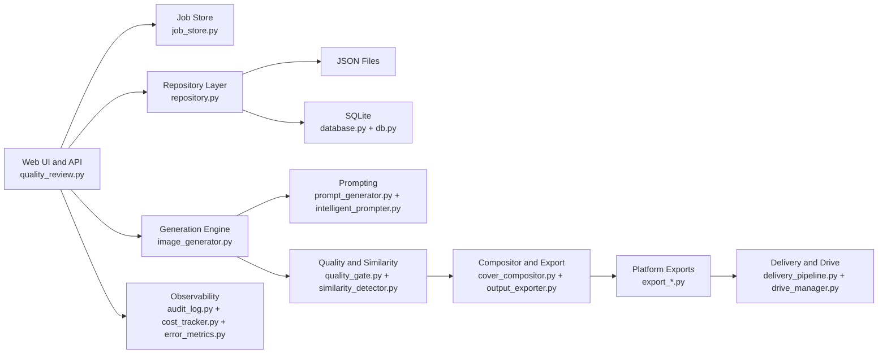

# Alexandria Cover Designer - Release Summary

Version: `2.0.0`
Date: `2026-02-22`

## Release Outcome
v2.0.0 completes Prompts 1 through 21 and hardens the project for production-style operation with multi-catalog workflows, export automation, SQLite scale path, and full audit/security validation.

## Feature Inventory (Prompts 1-21)
- Core pipeline: analyze -> prompt -> generate -> quality gate -> composite -> export.
- Iteration workflow: single-title mode with all-model generation and configurable variants.
- Prompt library: save/load/mix style anchors and reusable prompts.
- Winner workflow: review, selection, archive non-winners, regeneration loops.
- Multi-catalog operations and async job management.
- Analytics stack: costs, budgets, model quality comparison, completion tracking, reports.
- Similarity detection and mockup/social asset generation.
- Delivery stack: Amazon/Ingram/Social/Web exports, Drive sync, delivery tracking.
- Delivery completion semantics hardened for subset-platform runs and gdrive auto-push-disabled flows.
- Drive selected-file push path now rejects traversal outside output root.
- Scale path: SQLite schema, migration tool, repository abstraction, pagination across high-volume endpoints.
- Security and reliability: sanitization, path traversal protection, explicit static file allowlists, non-finite input rejection, thumbnail-source allowlists, rate limiting tiers, security headers, startup/runtime validation.
- Catalog-scoped artifact routing: `cover_regions`, intelligent prompt outputs, and winner selections now resolve per catalog id.
- Variant limits are now dynamic end-to-end in iterate/jobs UI (backend-configured max, not hardcoded 20).
- CLI/tooling defaults now honor active catalog-scoped winner/archive paths across export/archive/migration/print/mockup/social/drive flows.
- Catalog import now writes region analysis directly into catalog-scoped region files.
- Regeneration subprocess now receives/uses active catalog runtime (`/api/regenerate` -> `scripts/regenerate_weak.py --catalog ...`).

## Architecture

## API and Module Size
- `src/` modules: `42`
- `scripts/` modules: `19`
- API endpoints documented in `/api/docs`: `88`

## Performance Characteristics (Current Local Verification)
- Full test suite: `512 passed in 40.54s`
- Coverage: `97.01%` over `src/`
- Performance marker tests: pass (`tests/test_performance.py`)
- Load test (`10 users`, `60s`, local, read limit raised for benchmark):
  - P95: `36.46ms`
  - Throughput: `289.00 req/s`
  - Errors: `0`

## Production Verification Snapshot
- `validate_config.py`: pass (venv)
- `validate_environment.py`: pass (venv)
- `python -m compileall src scripts`: pass
- Docker build: pass (`alexandria-cover-designer:v2`)
- Docker runtime checks: `/api/health`, `/iterate`, `/api/docs` all HTTP 200
- Docker shutdown check: no traceback on container stop

## Deployment Options
- Local Python runtime (`scripts/quality_review.py`).
- Docker single-container deployment.
- Docker Compose deployment with persistent mounted `config/`, `data/`, and output directories.

## Known Limitations
- External provider behavior still depends on API quotas/availability and credential state.
- Drive pull mode is conservative for non-local mirror configurations.
- Some advanced UI runtime checks rely on smoke tests due Playwright launch constraints in this environment.

## Recommended Next Work
1. Add continuous background SLO alerting hooks to `/api/metrics` signals.
2. Expand golden-image regression coverage for composition and mockup outputs.
3. Add production dashboard panels for rate-limit and provider cooldown telemetry.
